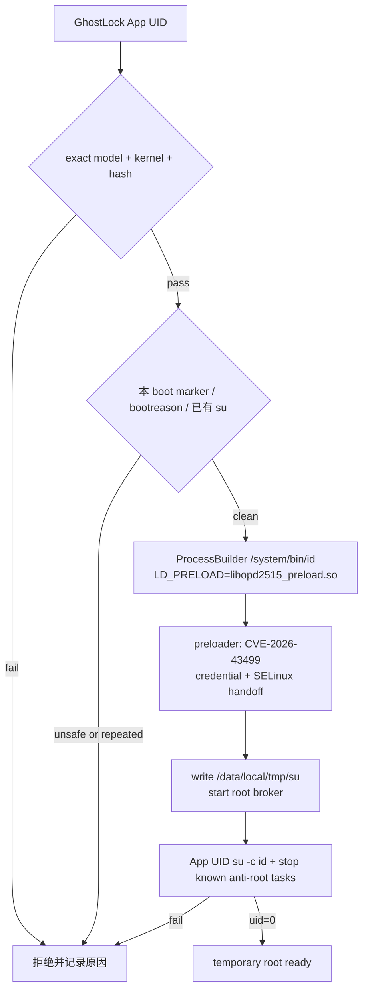

# OPD2515 App-UID temporary-root route plan（2026-10-10）

## 现状与基线

基线分支为 `opd2515-robustness`，其 exact OPD2515 preloader gate 保持关闭：
一次历史运行曾达到 `uid=0`，随后重复运行触发 kernel UBSAN 重启，因此该分支不把
Shizuku/shell-UID 路径标记为稳定。平板的 exact kernel 为
`6.12.58-android16-6-g7704a1ae279b-ab15213644-4k`。

公开的 [X9U preload builder](https://github.com/koaaN/x9u-preload-builder) 已在同一
kernel 字符串、同一 OPPO 系列上验证普通 App UID 通过 `LD_PRELOAD` 获得临时 root。
平板的 `boot-current.img` 与 `xbl_config-current.img` 已本地重新生成 target header；
生成的关键偏移与平板已有 target header 一致，`PSELECT_WAITER_WORD_SHIFT=14`。

## 目标与约束

目标是提供一个单独、明确标识的实验 APK：不依赖 ADB 或 Shizuku，由普通 App UID 启动
精确的 OPD2515 preloader，并把临时 root 交给现有 `/data/local/tmp/su` broker。

约束：

- 只接受 `Build.MODEL=OPD2515` 与 exact `uname -r`；
- 只接受从平板匹配 boot/xbl 生成、并经 SHA-256 固定的 preloader；
- 不写 boot/vendor/system 分区、不改 bootloader 状态；
- 每个 boot 只允许一次尝试；检测 `kernel_panic` 或 anti-root 恶意启动原因后拒绝；
- 普通 GhostLock APK 与 `opd2515-robustness` 分支继续 fail-closed；实验行为由
  `-Popd2515DirectExperimental=true` 构建属性显式开启；
- 未完成真机冷启动、30 秒存活、root handoff、重启后清理四项门禁前，不称为
  `supported` 或“稳定”。

## 改动清单

| 文件 | 改动 | 理由 |
| --- | --- | --- |
| `app/build.gradle.kts` | 增加 `OPD2515_DIRECT_EXPERIMENTAL` BuildConfig 字段 | 防止普通构建误启用高风险入口 |
| `app/src/main/kotlin/com/ghostlock/app/data/AndroidGhostlockRepository.kt` | 增加 exact target gate、App-UID `LD_PRELOAD` 启动、每 boot marker、日志与 root postflight | 复用已验证的 X9U App-UID 入口，保持现有 UI/日志契约 |
| `.github/workflows/build.yml` | 实验分支构建时传入 opt-in property，并核验 preloader hash | 生成可审计的实验 APK |
| `docs/analysis/device-gates/OPD2515-appuid-direct-plan.md` | 记录设计、边界与验证矩阵 | 使未验证状态可追溯 |

## 数据流/控制流差异

原有安全分支仍走：普通 profile → `libghostlock.so`，或 exact OPD2515 → Shizuku
preloader（当前 gate 关闭）。实验构建只对 exact OPD2515 把“运行入口”切换为上图；
其余 kernel 的行为不变。

## 兼容性与回滚

卸载实验 APK、重启设备或删除 app-private marker 即可撤销 App 层改动；preloader 的
root 与 `su` daemon 本身是易失状态，重启后消失。源码回滚只需切回
`opd2515-robustness`；实验分支不向原始仓库推送。

## 验证矩阵

| 批次 | 验证 | 通过条件 |
| --- | --- | --- |
| A | Kotlin/Gradle unit tests | 编译通过，普通构建 `BuildConfig=false` |
| B | APK 静态检查 | 仅 arm64 包含 preloader；hash 为已知的 `CCB15...F4EE`（Windows）或 `01C7...441C`（CI Linux）；实验 APK 字段为 true |
| C | 平板干净启动 | bootreason 无 panic，首次运行只执行一次，日志含 target/hash |
| D | 临时 root | 日志含 `uid=0`、`su daemon ready`、postflight `uid=0`，设备 30 秒不重启 |
| E | 重启复测 | root/marker 旧状态不被误用；新 boot 可在用户主动点击后再次尝试 |

目前只完成 A 的代码准备和 B 的本地 target/preloader 重建；C–E 必须在平板在线后
执行，不能从构建结果推断成功。

## 明确保留

- 不改 `src/` 的通用 native route、profile wire 或 kernelsnitch；
- 不改变原有 `ShizukuExploitRunner` 的 shell-UID 代码；
- 不使用 X9U 的预编译 payload；每个设备仍必须从自己的 boot/xbl 重新生成；
- 不执行分区写入、GBL chainload 或 bootloader 解锁。

## 同内核证据与实现差异

`koaaN/x9u-gbl-chainload-app` 的 `RootOps` 是目前最直接的 App-UID 证据：普通
Activity 用 `ProcessBuilder` 启动 `/system/bin/sh`，设置 `LD_PRELOAD` 指向 APK 的
native library，并通过 app-private broker 与 root daemon 通信；它不要求 ADB 或
Shizuku。其 X9U `target.h` 与 OPD2515 从本机 boot/xbl 重新生成的 `target.h` 字节
一致，包含 `PSELECT_WAITER_WORD_SHIFT=14` 和相同的关键内核地址。

其他 SM8850/8E5 项目大多仍把完整链放在 ADB shell 中，或只提供 seccomp 受限的
bootstrap/mini-adb 第二阶段；它们证明的是漏洞跨设备可移植性，不是 OPD2515 的
无 ADB 入口。`JoinChang/ghostlock-oneplus` 还把 X9 Ultra 列为其旧实现的
“not feasible”，因此本分支只把 X9U 的 App-UID 启动方式和 OPD2515 自己的
preloader 结合，保持实验开关，不能把公开项目的互相矛盾直接当作平板验证。

实验分支的 Java 侧以 native 输出中的
`direct-root-summary root=1 ... su=1/...` 作为主要交接证据；`/data/local/tmp/su`
的 Java 进程执行和 anti-root 停止动作均为 best-effort，native payload 本身已在
获得 root 后停止 `ExSystemService`。这样不会因为 untrusted_app 的 SELinux
`execute`/`connectto` 限制，把已经成功的临时 root 报成失败。

## 进度

- [x] 从平板 boot/xbl 重新生成 target header
- [x] 用 NDK r27 重建 exact OPD preloader，hash 固定
- [x] 增加 opt-in App-UID Android 入口与 per-boot fail-closed guard
- [x] CI 编译实验 APK（`37960284218`，preloader hash 验收通过）
- [x] 实验分支额外上传保持 APK 容器完整的安装包
- [ ] 平板冷启动真机门禁
- [ ] 重启后再次激活门禁
