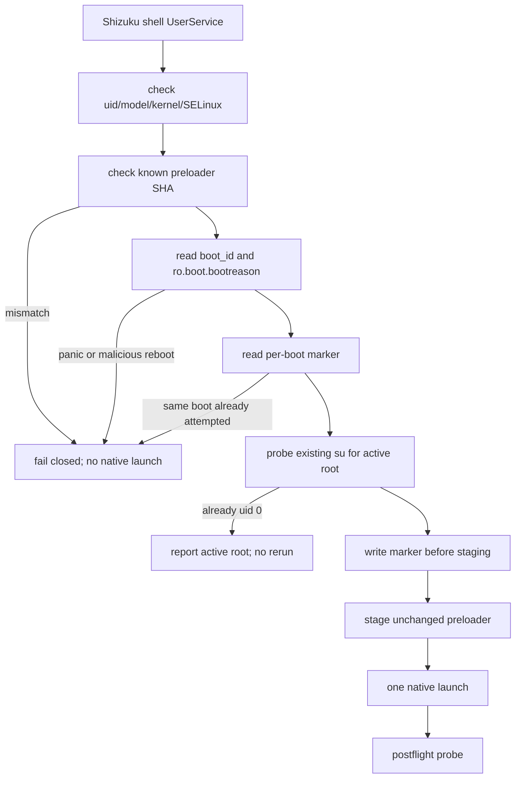

# OPD2515 robustness hardening plan (2026-10-09)

## Current state and baseline

Baseline branch: `opd2515-stable-standalone`, current tree before this batch.
The historical standalone preloader completed one controlled root handoff on
the exact OPD2515 target, but a later repeat attempt ended in
`kernel_panic,ubsan:_array_index_out_of_bounds:_fatal_exception`. The failure
was observed before root handoff and was not an OPPO anti-root reboot.

The current app starts the preloader after checking only the Shizuku UID and
`Seccomp=0`. The Shizuku runner can reconnect up to three times, and the
preloader entry has no persistent per-boot attempt marker.

## Goal and constraints

Make the APK fail closed after an unsafe boot or a completed attempt, preserve
diagnostic evidence, and prevent the app from launching the same high-risk
preloader repeatedly in one boot. Keep the historical standalone native
payload byte-for-byte unchanged. Do not add a direct app-UID fallback, a new
shift, a second `LD_PRELOAD` library, partition writes, or a claim that the
route is stable.

## Change list

| File | Change | Reason |
| --- | --- | --- |
| `app/src/main/kotlin/com/ghostlock/app/shizuku/GhostlockUserService.kt` | Add exact model/kernel/SELinux and known-SHA preflight, boot ID / bootreason checks, per-boot marker, stale `su` probe, and explicit logs. | Reject wrong execution environments, unknown payloads, unsafe boot states, and duplicate attempts before starting the native process. |
| `app/src/main/kotlin/com/ghostlock/app/shizuku/GhostlockUserService.kt` | Tighten the per-app staging directory and cap the standalone preloader at 30 seconds. | Prevent shared-temp replacement and an unbounded UserService/native hang. |
| `app/src/main/kotlin/com/ghostlock/app/shizuku/ShizukuExploitRunner.kt` | Do not retry a preloader UserService connection. | A reconnect can otherwise launch the high-risk route more than once after a partial failure. |
| `app/src/main/kotlin/com/ghostlock/app/boot/BootRelayReceiver.kt` | Schedule one direct-boot/network-aware Shizuku relay job. | Give ColorOS one safe retry point after Wi-Fi is available without touching the native payload. |
| `app/src/main/kotlin/com/ghostlock/app/boot/ShizukuBootRelayJobService.kt` | Attempt Shizuku's exported boot receiver once and finish the job on all paths. | Reuse Shizuku's own ADB-key path when the platform permits it; catch protected-broadcast rejection and fail closed. |
| `docs/analysis/device-gates/OPD2515-preloader.md` | Record the repeat panic and the new safety boundaries. | Keep PASS and FAIL evidence together and prevent the old one-run PASS from being overstated. |
| `docs/analysis/opd2515-support-plan.md` | Add the robustness batch and the no-ADB limitation. | Make the operational contract discoverable. |

## Control-flow difference

The marker is written before the native process starts and is keyed to
`/proc/sys/kernel/random/boot_id`, so a failed attempt cannot be retried by a
second click in the same boot. A reboot changes the key; a panic bootreason is
still rejected until the user performs another clean reboot. The marker and
logs are volatile user-data artifacts and are not a persistence mechanism.

## Compatibility and rollback

The native library and its invocation environment remain unchanged. Removing
the Kotlin guard restores the former retry behavior, but is deliberately not a
recommended rollback after a kernel panic. Deleting the marker only removes the
local safety record; it does not make the underlying preloader safer.

## Verification matrix

| Check | Expected result |
| --- | --- |
| Kotlin compile and unit tests | pass |
| APK packaging / preloader hash | unchanged standalone preloader hash |
| `git diff --check` | no whitespace errors |
| Static inspection | no direct UID route or retry for OPD2515 |
| Current panic boot | app logs fail-closed and never starts native |
| Clean boot with no Shizuku | app reports Shizuku not running; no root claim |

## Explicitly retained

The historical preloader sources, exact compiler input, anti-root stop logic,
postflight `su` probe, locked bootloader assumptions, and temporary-root
semantics remain unchanged. No automatic reboot, no persistent service, and no
new kernel exploit variant are introduced in this batch.

## Batch I — clean reboot and Shizuku auto-start check

The tablet was rebooted with Shizuku's ADB launch mode recorded and its boot
receiver present. The receiver did run at `LOCKED_BOOT_COMPLETED`, but ColorOS
delivered that broadcast before `wlan0` had an address. Android logged
`Not connected to any wireless network. Not enabling adbwifi`; after boot,
`adb_wifi_enabled` was back to `0` and no `shizuku_server` process existed.
This is a platform timing/policy limit, not an app crash. The GhostLock app
cannot send the protected boot broadcast or create a shell-UID service by
itself, so it does not add a background exploit retry or an unencrypted
TCP-ADB fallback.

## Batch II — safe relay verification on OPD2515

Build `versionCode=593` was installed on the exact OPD2515 target after the
preloader route had been disabled. The UI reported `不支持 / 未找到匹配的内核配置`;
the Shizuku switch was hidden for this unsupported target. A real reboot then
produced the following safe sequence:

1. ColorOS delivered `LOCKED_BOOT_COMPLETED` to `BootRelayReceiver`.
2. Job `4672578` (`0x474c42`) started and finished once.
3. The job's explicit `BOOT_COMPLETED` handoff to Shizuku was rejected by
   ActivityManager: `Permission Denial: not allowed to send broadcast
   android.intent.action.BOOT_COMPLETED from pid=8730, uid=10049`.
4. No `shizuku_server` process appeared, `adb_wifi_enabled` remained `0`, and
   the native GhostLock payload was never invoked.

The relay is therefore a harmless best-effort compatibility hook, not a
promise of no-ADB startup. A normal APK cannot create UID 2000, write
`WRITE_SECURE_SETTINGS`, or send a protected boot broadcast. Guaranteeing
post-reboot Shizuku startup would require a privileged/modified Shizuku path,
device-owner privileges, or a validated root route.

## Progress

- [x] Record baseline and failure evidence.
- [x] Add Kotlin guards.
- [x] Run host/CI verification (GitHub Actions run `37946642297`, 10m27s).
- [x] Install and reboot-test without executing the OPD2515 native payload.
