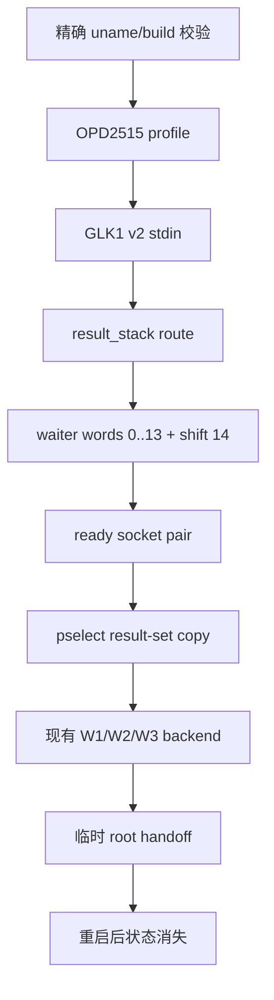
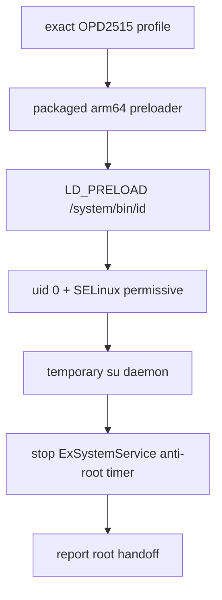
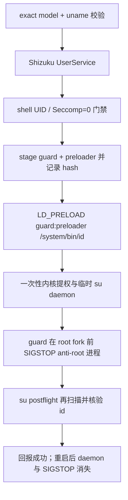

# OPD2515 临时 root fork 计划（2026-10-08）

## 现状与基线

- 仓库分支：`main`，基线 commit：`3d4306c`。
- 设备：OPPO Pad Mini `OPD2515`，固件 `OPD2515_16.0.10.500(CN01)`。
- 内核：`6.12.58-android16-6-g7704a1ae279b-ab15213644-4k`。
- bootloader：locked；本计划不解锁、不写 `abl`、`efisp`、`init_boot` 或其他分区。
- 已验证入口：OPD2515 专用 `preload.so`。它通过 result-set 形式的 pselect 路径完成一次性内核写入，随后安装 `/data/local/tmp/su` 和临时 daemon。重启后内核状态和 daemon 消失。
- 当前 GhostLock native 的 `select_stack_route` 只把 waiter words 映射到三组输入 fd_set。对 OPD2515 的 `waiter_shift=14`，它不能复现 preloader 的 result-set 映射；直接导入 profile 不安全。

## 目标与约束

目标：做一个独立 fork，使 GhostLock 能识别并支持上述精确内核，提供一次点击的临时 root 入口；每次重启后 root 消失，下一次需重新执行。

约束：

- 只支持精确 `release`，型号、固件和 `uname -r` 任一不匹配都拒绝运行。
- 不执行 fastboot、`dd`、ABL/efisp/init_boot 写入、bootloader 解锁或 OTA 持久化。
- 保留现有 `select_stack`、`tcp_zerocopy`、`multicast_waiter` 的行为和 profile 语义。
- 不修改 `kernelsnitch/`、v1 profile 转换或已验证设备条目。
- 不把失败的 OPD2515 路径标记为 `supported`，直到通过冷机真机门禁。

## 方案选择

采用“OPD2515 专用 result-stack route + profile”的 fork 方案，而不是把 `waiter_shift=14` 填入现有 route。新 route 复用现有 backend 的 `WriteRequest`、address-space、W1/W2/W3 和 handoff 契约，只把 pselect fd-set 构造、result-set 复制和 route 生命周期隔离到新 middleware。这样不会改变已验证 route 的攻击函数形状。

网页 preloader 中的直接 root 和临时 `su` 逻辑作为验证基线，不作为 profile 字段；profile 只描述内核地址、结构偏移、route 几何和执行调参。若 native handoff 在 OPD2515 上无法复用，再单独评审 Shizuku UserService 的 preloader bootstrap，不把两种入口混在第一批改动中。

## 改动清单

### 批次 A：route 与 profile 契约

| 文件 | 改动 | 理由 |
|---|---|---|
| `src/core/profile/model.h` | 增加 `result_stack` route kind 与布局字段 | 让 route 选择显式进入 TargetProfile |
| `src/core/profile/binary.cpp` | 注册 route section/字段 | 保持 GLK1 v2 双侧契约 |
| `src/core/route/component_catalog.hpp`、`route_policy.hpp`、`orchestrator.hpp` | 注册可用组合与 compile-time dispatch | 避免按 kernel 版本隐式选择 |
| `src/core/route/result_stack_route.h/.cpp` | 实现 words 0–13、`waiter_shift=14`、ready socket pair、result-set 映射、`prepare → execute → disarm → destroy` | 复现已验证 preloader 的关键几何，同时保持资源所有权显式 |
| `src/core/session/backend/cve_2026_43499_backend.cpp` | 显式实例化新 route | 完成模板 backend 组合 |
| `src/Makefile` | 编译新 route | 纳入 native 产物 |
| `profile-core/.../RouteKind.kt`、route config、`NativeProfile.kt` | Kotlin 侧同步 route token、wire 值和字段 | 双侧键名与 presence 保持一致 |
| `app/src/main/assets/kernel_profiles/6.12.58-...conf` | 增加 OPD2515 精确 profile，`result_stack.waiter_shift=14`、`kernel_phys_load=0xa8000000`、精确地址/结构偏移 | 只让 exact release 命中 |
| `app/src/main/assets/kernel_profiles/index.conf` | 登记候选 profile，但先标记为 unverified | 未过真机门禁前不宣称支持 |

### 批次 B：测试与证据

| 文件 | 改动 | 理由 |
|---|---|---|
| `src/core/tests/result_stack_route_test.cpp` | fd-set 几何、负 shift/越界、result-set 选择和生命周期测试 | 在主机验证不会写出边界 |
| `src/core/tests/profile_binary_test.cpp`、catalog/policy tests | 增加新 route 的 wire/dispatch 断言 | 防止 Kotlin/native 漂移 |
| `tools/cmp_disasm.py` | 登记新 route 的关键函数 | 攻击关键路径必须可审计 |
| `docs/analysis/device-gates/OPD2515-result-stack.md` | 记录每次真机冷机 PASS/FAIL、日志、panic/reboot | 失败和通过都可追溯 |

### 批次 C：Android 入口

只有批次 A/B 通过后才做。检查现有 Shizuku UserService 是否能以 shell UID、无 seccomp 启动新 route；如需要设备专用 bootstrap，新增显式入口和状态日志，不改变普通 route 的启动逻辑。

## 数据流与控制流差异

不变的不变量：PI waiter/owner/consumer 的停止顺序、`RouteStatus` 生命周期、失败时的 dirty 语义、profile 作为唯一配置权威。新 route 不复用旧 route 的静态 fd 状态，也不允许在 consumer 仍 in-flight 时关闭 result socket。

## 兼容性与回滚

- profile 不匹配时早拒绝，不尝试近似内核或自动猜 shift。
- 新 route 只由新 route kind 调度；删除 profile 条目即可回到原始 App 行为。
- 真机失败只允许保留用户态临时文件；不写启动分区。发生 kernel panic/reboot 时记录为 FAIL，不自动重试变体。

## 验证矩阵

| 批次 | 命令/入口 | 预期 |
|---|---|---|
| A | `make -C src native-host-tests` | 全部 host tests PASS |
| A | `make -C src lint-tidy` | 0 findings |
| A | `./gradlew :app:testDebugUnitTest --offline` | Kotlin tests PASS |
| A | `./gradlew exportKernelProfiles` | OPD2515 GLK1 可生成且字段 presence 正确 |
| B | `python3 tools/cmp_disasm.py <baseline> build/native/ghostlock` | 既有函数 strict identical；新增差异逐项复核 |
| C | 冷机、KernelSU 未加载、固定 CPU、单 route 真机运行 | uid 0、route_done、W1/W2/W3、handoff 和清理状态有日志 |
| C | 真机重启后复查 | 普通 shell uid 2000；无可用临时 daemon；不改分区 |

## 明确保留

- 不动现有三条 route 和 `kernelsnitch/`。
- 不把网页 preloader 的二进制直接提交为仓库生成物。
- 不执行 GBL Root Canoe 的 raw `efisp`/`persist` 写入；该工具要求已有 root/unlocked 状态。
- 不把单次网页 preloader 成功当作 GhostLock fork 的真机支持结论。

## 进度

- [x] 完成 OPD2515 exact kernel 和 preloader 路径静态对照
- [x] 确认现有 route 无 result-set 支持
- [x] 用户认可本计划
- [x] 批次 A 实现（待 CI 编译验证）
- [ ] 批次 A/B 主机验证
- [ ] 批次 C 真机门禁

## 批次 D：OPD2515 应用入口（补充设计，2026-10-09）

批次 C 的真机结果显示，现有 `result_stack` native route 在普通应用入口
会先触发 OPPO 的 `oplus_kevent`，随后由 `OplusAntiRootDialogService`
重启设备；而独立的、同一内核构建生成的 preloader 在应用 UID 10045
环境中可以完成 uid 0。批次 D 因此增加一个精确版本的应用入口，不再把
失败的通用 route 当作 OPD2515 的唯一入口。

### 设计决定

- 将可重建的 OPD2515 preloader C 源码和精确 target header 放入 fork 的
  `tools/opd2515_preload/`，由 GitHub Actions 使用 ONDK 生成
  `libopd2515_preload.so`；不提交预编译 exploit 二进制。
- APK 仅在内置 OPD2515 release profile 命中时选择该入口；其他 profile
  继续使用原有 native route，不改变已有设备行为。
- preloader 进程通过 `LD_PRELOAD=/.../libopd2515_preload.so`
  启动 `/system/bin/id`，成功后在 `/data/local/tmp` 提供临时 daemon。
- root handoff 的第一阶段只报告 uid 0、SELinux 和 daemon 状态，并记录
  精确日志；KernelSU 加载仍沿用已有显式脚本，不与普通 route 混合。
- 取得 root 后，OPD2515 专用 preloader 会停止当前
  `com.oplus.exsystemservice` 进程，避免已确认的 anti-root 15 秒计时器
  在 root 成功后触发重启。该停止状态只存在于本次开机，重启后自然清除。

### 入口数据流

### 验证门槛

- 编译 preloader 与 APK 的 host/CI 构建必须可重复；检查 target header、
  ELF 架构和 SHA-256。
- 真机冷机门禁必须分别记录：应用 UID 直接入口、root/daemon、
  ExSystemService 状态、重启后无 daemon；任何 kernel panic/reboot 均为
  FAIL，不自动重试。
- 旧的 `result_stack` 入口保留为实验路径，直到新入口完成上述门禁；不把
  失败批次标为 supported。

## 2026-10-09 崩溃复盘与入口隔离

设备本次启动后的 `ro.boot.bootreason` 为
`kernel_panic,ubsan:_array_index_out_of_bounds:_fatal_exception`，不是
此前 OPPO anti-root 计时器使用的
`reboot,malicious_app_try_to_root_devices`。本次运行前应用界面中的
Shizuku 选项处于开启状态，而 `GhostlockUserService` 固定启动通用的
`libghostlock.so`，不会选择 OPD2515 专用 `libopd2515_preload.so`。由于
崩溃后没有保留下来的 pstore 调用栈，不能把具体 UBSAN 指令位置说成已
定位；现有证据把这次事件归类为“通用 Shizuku/result-stack 入口失败”。

独立的 OPD2515 preloader 日志（设备上的 `/data/local/tmp/preload.out`，
2026-10-09 00:51）记录了同一精确内核上的 `shift=14`、KASLR 泄漏、
`uid=0`、临时 `su` 和 anti-root 进程停止，说明它至少有一次完成了整条
直接入口。精确 vmlinux 反汇编也显示
`futex_wait_requeue_pi` 将 `sp+0xa0` 作为 `rt_mutex_waiter` 传给
`rt_mutex_wait_proxy_lock`，与 14 个 qword 的 preloader payload 相符；
先前“shift=14 必然落在 futex_q、应改为 28”的静态假设已撤回，不能再用
它指导变体试验。

为防止用户误把通用 Shizuku 路径再次运行，上一版应用层曾对精确 OPD2515
拒绝 Shizuku 入口，并关闭默认推荐。该入口隔离只适用于旧的通用
`libghostlock.so` 路径；批次 E 改为显式选择 shell UID 专用 preloader。
应用 UID direct 入口仍必须拒绝，下一次真机测试前仍需保留完整启动证据，
并把任何 panic/reboot 记为失败，不自动尝试 shift 变体。

## 2026-10-09 11:19 直接 preloader 复测失败

在密码已关闭、Shizuku 明确关闭的条件下，应用日志
`Download/ghostlock-debug-log/20261009-111901/ghostlock-direct-0.log`
确认本次确实进入了 OPD2515 专用 `libopd2515_preload.so`，而不是通用
`libghostlock.so`。日志显示：

- `shift=14` 的 KASLR 泄漏阶段完成，`slide-kaslr-ok` 成功；
- `per_cpu_offset`、`entry_task` 两次读回通过；
- 读取 `selinux_enforcing` 得到 `raw=0100000101010101`，不是合法的 0/1，
  但代码随后按“无法读取则假定 enforcing=1”继续；
- 在第一次真实内核写入 `install_real_cred`（`direct-w64[3]`）之后日志
  截断，设备自动重启。

重启后 `ro.boot.bootreason` 为
`kernel_panic,ubsan:_array_index_out_of_bounds:_fatal_exception`，普通
shell 仍为 uid 2000，`/sys/fs/pstore` 没有可读的内核 console/ramoops
调用栈。因此，之前 `/data/local/tmp/preload.out` 中一次成功的旧日志不能
作为稳定性证据；本次结果把直接 preloader 也定为 FAIL。当前不能再运行
任何 shift 变体、通用 Shizuku 路径或重复 direct 路径，必须先离线修复
result-set 读写验证和失败即停止的门禁。

## 批次 E：shell UID 专用 preloader 入口（设计，2026-10-09）

应用 UID 10045 的 direct 复测在第一次真实写入前已经读到非法的
`selinux_enforcing` 值，并在 `install_real_cred` 后触发 UBSAN。旧的成功
记录来自 shell UID 2000，且没有经过当前应用的 seccomp 环境。因此，下一批
只研究 UID/环境差异，不再让应用进程直接加载 preloader。

### 目标与约束

- Shizuku UserService 只负责以 shell UID、`Seccomp=0` 启动精确的
  `libopd2515_preload.so`；不得调用通用 `libghostlock.so`。
- 精确 OPD2515 的应用 UID direct 入口必须早拒绝；不能让用户误触发已失败
  的路径。
- 不改变其他设备的 route、profile 或 Shizuku 行为；不写分区，不解锁 BL。
- 任何真机测试前，必须先验证 UserService 的 UID/seccomp、二进制 hash 和
  日志目录；panic/reboot 立即判 FAIL，不自动重试。

### 改动清单

| 文件 | 改动 | 理由 |
|---|---|---|
| `app/src/main/aidl/com/ghostlock/app/shizuku/IGhostlockUserService.aidl` | 增加专用 `runOpd2515Preloader` 调用 | 显式区分 shell preloader 与通用 native route |
| `app/src/main/kotlin/com/ghostlock/app/shizuku/GhostlockUserService.kt` | 校验 shell UID/`Seccomp=0`，启动 APK 内精确 preloader 并转发日志 | 复现旧成功日志的执行环境，避免应用 UID seccomp |
| `app/src/main/kotlin/com/ghostlock/app/shizuku/ShizukuExploitRunner.kt` | 增加专用 UserService 调用与连接生命周期 | 保持 Binder/回调清理边界明确 |
| `app/src/main/kotlin/com/ghostlock/app/data/AndroidGhostlockRepository.kt` | exact OPD2515 的 direct 入口早拒绝；Shizuku 入口选择专用调用 | 防止再次触发已失败 direct 路径 |
| `app/src/main/assets/kernel_profiles/6.12.58-...conf` | 将 `recommend_shizuku` 设为 1，并注明这是专用入口 | 新包默认走 shell UID 入口 |
| `app/build.gradle.kts` / CI 调用 | 使用独立 fork applicationId，避免与原包签名冲突 | 不卸载现有 GhostLock，不覆盖其数据 |

### 验证矩阵

1. `:profile-core:test`、`:app:testDebugUnitTest` 和 CI APK 构建通过。
2. 新 APK 独立安装后只读确认包名、APK/SO SHA-256、Shizuku 状态。
3. 首次真机运行只允许专用 shell preloader；成功标准同时包括
   `uid=0`、`direct-root-summary root=1`、`su` socket 和无 panic。
4. 失败时只收集日志和 `bootreason`，不重试、不切换 shift。

## 批次 F：独立 anti-root guard 与一键入口（2026-10-09）

批次 E 的入口已经把执行环境固定到 Shizuku shell UID，但现有源码仍把
`ExSystemService` 停止逻辑编译进 preloader。这个内置逻辑会改变已验证
preloader 的函数布局和时序；而 OPD2515 的 anti-root 组件实际使用的
进程名是 `exsystemservice`，不是包名。批次 F 将两件事分离：保持
preloader 的攻击代码和编译输入不变，在同一个 `LD_PRELOAD` 链中放置一个
很小的 guard，guard 只在当前线程已经变成 uid 0、即将第一次 `fork()` 时
冻结 `exsystemservice`、`com.oplus.exsystemservice` 和 `oplus_kevent`。

### 设计决定

- `tools/opd2515_preload/src/preload.c`、`main.c` 和 `common.h` 删除内置
  anti-root 停止函数及其调用；不调整 result-set、slide、cred 写入或
  embedded `su` 的顺序和参数。
- 新增 `src/root_guard.c`，通过 `fork()` 的动态链接拦截在 root 身份建立
  后扫描 `/proc/*/comm`，只发送 `SIGSTOP`；它不改分区、不改启动属性，
  不负责凭据提升。
- Makefile 和 Gradle 同时构建、打包 `libopd2515_preload.so` 与
  `libopd2515_root_guard.so`。APK 运行时按 guard:preloader 顺序加载，
  并把两份 SHA-256 写入本次调试日志。
- preloader 结束后由 root daemon 做一次幂等 postflight 扫描，补停在竞争
  窗口内重新出现的同名进程；随后执行 `su -c id` 作为 handoff 门禁。任何
  一个库缺失、UserService 不是 shell UID、Seccomp 非 0 或 su 探针失败，
  都返回失败，不把一次半成功报告成 root。
- 精确 OPD2515 仍只能从 Shizuku UserService 启动；应用 UID 的旧
  `runOpd2515Preloader` 分支删除，普通设备和既有 route 不改变。

### 入口数据流

### 改动清单

| 文件 | 改动 | 理由 |
|---|---|---|
| `tools/opd2515_preload/src/preload.c`、`main.c`、`common.h` | 删除内置 anti-root 停止代码 | 保持历史 preloader 攻击布局 |
| `tools/opd2515_preload/src/root_guard.c` | 新增独立、可审计的进程 guard | 把反 root 处理与 exploit 解耦 |
| `tools/opd2515_preload/Makefile` | 增加 `root_guard.so` 构建目标 | 确保 guard 来自源码并可重复构建 |
| `build.gradle.kts`、`app/build.gradle.kts` | 构建并打包两份 arm64 JNI 库 | APK 一键入口需要两份输入 |
| `GhostlockUserService.kt` | stage 两份库、设置 LD_PRELOAD、postflight、hash/门禁日志 | 只允许精确 shell 路径成功 |
| `AndroidGhostlockRepository.kt` | 删除应用 UID 旧 preloader 分支并保持 fail-closed | 防止误触发已失败路径 |
| `docs/analysis/device-gates/OPD2515-preloader.md` | 记录冷机安装、运行、重启后复核 | 给成功和 panic/reboot 都留下证据 |

### 验证门槛

1. 源码检查确认 preloader 不再引用 `stop_oplus_exsystemservice`，而
   `root_guard.c` 只包含进程扫描、`SIGSTOP` 和 `fork` 拦截。
2. ONDK 构建同时产出 arm64 ELF；检查 `readelf -h`、尺寸、SHA-256，
   并运行仓库现有 host/Kotlin 测试和 CI APK 构建。
3. 安装 fork APK 后，在不重启的当前设备上只读核对包名、两份库 hash、
   Shizuku shell UID 和 UserService 日志。
4. 冷机门禁：点击一次入口，至少观察 30 秒不重启，`su -c id` 为 uid 0，
   anti-root 目标进程为 stopped/不存在；然后重启，确认普通 shell 为
   uid 2000、`temp_su.sock` 不可用、未写任何分区。
5. 任何 kernel panic、自动重启、hash/target 不匹配均为 FAIL；不自动
   重试 shift 或替换 preloader 二进制。

### 明确保留

- 不修改 `kernelsnitch/`、v1 profile converter、现有三条通用 route。
- 不提交预编译 exploit 二进制；CI 从 C 源码构建两份库。
- 不解锁 bootloader，不写 `abl`、`efisp`、`init_boot`、`persist` 或其他
  分区；所有 guard 状态依赖当前开机，重启即消失。

## 批次 F 进度

- [x] 完成独立 guard 设计和精确进程名核对
- [ ] 删除 preloader 内置 guard 并接入源码构建
- [ ] 完成 APK 打包、主机测试和 CI 构建
- [ ] 完成当前设备冷机真机门禁
- [ ] 完成重启后无 root/无 daemon 复核
