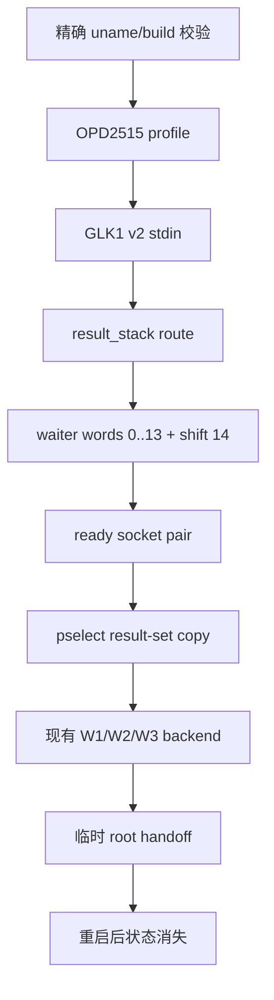

# OPD2515 临时 root fork 计划（2026-10-08）

## 现状与基线

- 仓库分支：`main`，基线 commit：`3d4306c`。
- 设备：OPPO Pad Mini `OPD2515`，固件 `OPD2515_16.0.10.500(CN01)`。
- 内核：`6.12.58-android16-6-g7704a1ae279b-ab15213644-4k`。
- bootloader：locked；本计划不解锁、不写 `abl`、`efisp`、`init_boot` 或其他分区。
- 已验证入口：OPD2515 专用 `preload.so`。它通过 result-set 形式的 pselect 路径完成一次性内核写入，随后安装 `/data/local/tmp/su` 和临时 daemon。重启后内核状态和 daemon 消失。
- 当前 GhostLock native 的 `select_stack_route` 只把 waiter words 映射到三组输入 fd_set。对 OPD2515 的 `waiter_shift=14`，它不能复现 preloader 的 result-set 映射；直接导入 profile 不安全。

## 目标与约束

目标：做一个独立 fork，使 GhostLock 能识别并支持上述精确内核，提供一次点击的临时 root 入口；每次重启后 root 消失，下一次需重新执行。

约束：

- 只支持精确 `release`，型号、固件和 `uname -r` 任一不匹配都拒绝运行。
- 不执行 fastboot、`dd`、ABL/efisp/init_boot 写入、bootloader 解锁或 OTA 持久化。
- 保留现有 `select_stack`、`tcp_zerocopy`、`multicast_waiter` 的行为和 profile 语义。
- 不修改 `kernelsnitch/`、v1 profile 转换或已验证设备条目。
- 不把失败的 OPD2515 路径标记为 `supported`，直到通过冷机真机门禁。

## 方案选择

采用“OPD2515 专用 result-stack route + profile”的 fork 方案，而不是把 `waiter_shift=14` 填入现有 route。新 route 复用现有 backend 的 `WriteRequest`、address-space、W1/W2/W3 和 handoff 契约，只把 pselect fd-set 构造、result-set 复制和 route 生命周期隔离到新 middleware。这样不会改变已验证 route 的攻击函数形状。

网页 preloader 中的直接 root 和临时 `su` 逻辑作为验证基线，不作为 profile 字段；profile 只描述内核地址、结构偏移、route 几何和执行调参。若 native handoff 在 OPD2515 上无法复用，再单独评审 Shizuku UserService 的 preloader bootstrap，不把两种入口混在第一批改动中。

## 改动清单

### 批次 A：route 与 profile 契约

| 文件 | 改动 | 理由 |
|---|---|---|
| `src/core/profile/model.h` | 增加 `result_stack` route kind 与布局字段 | 让 route 选择显式进入 TargetProfile |
| `src/core/profile/binary.cpp` | 注册 route section/字段 | 保持 GLK1 v2 双侧契约 |
| `src/core/route/component_catalog.hpp`、`route_policy.hpp`、`orchestrator.hpp` | 注册可用组合与 compile-time dispatch | 避免按 kernel 版本隐式选择 |
| `src/core/route/result_stack_route.h/.cpp` | 实现 words 0–13、`waiter_shift=14`、ready socket pair、result-set 映射、`prepare → execute → disarm → destroy` | 复现已验证 preloader 的关键几何，同时保持资源所有权显式 |
| `src/core/session/backend/cve_2026_43499_backend.cpp` | 显式实例化新 route | 完成模板 backend 组合 |
| `src/Makefile` | 编译新 route | 纳入 native 产物 |
| `profile-core/.../RouteKind.kt`、route config、`NativeProfile.kt` | Kotlin 侧同步 route token、wire 值和字段 | 双侧键名与 presence 保持一致 |
| `app/src/main/assets/kernel_profiles/6.12.58-...conf` | 增加 OPD2515 精确 profile，`result_stack.waiter_shift=14`、`kernel_phys_load=0xa8000000`、精确地址/结构偏移 | 只让 exact release 命中 |
| `app/src/main/assets/kernel_profiles/index.conf` | 登记候选 profile，但先标记为 unverified | 未过真机门禁前不宣称支持 |

### 批次 B：测试与证据

| 文件 | 改动 | 理由 |
|---|---|---|
| `src/core/tests/result_stack_route_test.cpp` | fd-set 几何、负 shift/越界、result-set 选择和生命周期测试 | 在主机验证不会写出边界 |
| `src/core/tests/profile_binary_test.cpp`、catalog/policy tests | 增加新 route 的 wire/dispatch 断言 | 防止 Kotlin/native 漂移 |
| `tools/cmp_disasm.py` | 登记新 route 的关键函数 | 攻击关键路径必须可审计 |
| `docs/analysis/device-gates/OPD2515-result-stack.md` | 记录每次真机冷机 PASS/FAIL、日志、panic/reboot | 失败和通过都可追溯 |

### 批次 C：Android 入口

只有批次 A/B 通过后才做。检查现有 Shizuku UserService 是否能以 shell UID、无 seccomp 启动新 route；如需要设备专用 bootstrap，新增显式入口和状态日志，不改变普通 route 的启动逻辑。

## 数据流与控制流差异

不变的不变量：PI waiter/owner/consumer 的停止顺序、`RouteStatus` 生命周期、失败时的 dirty 语义、profile 作为唯一配置权威。新 route 不复用旧 route 的静态 fd 状态，也不允许在 consumer 仍 in-flight 时关闭 result socket。

## 兼容性与回滚

- profile 不匹配时早拒绝，不尝试近似内核或自动猜 shift。
- 新 route 只由新 route kind 调度；删除 profile 条目即可回到原始 App 行为。
- 真机失败只允许保留用户态临时文件；不写启动分区。发生 kernel panic/reboot 时记录为 FAIL，不自动重试变体。

## 验证矩阵

| 批次 | 命令/入口 | 预期 |
|---|---|---|
| A | `make -C src native-host-tests` | 全部 host tests PASS |
| A | `make -C src lint-tidy` | 0 findings |
| A | `./gradlew :app:testDebugUnitTest --offline` | Kotlin tests PASS |
| A | `./gradlew exportKernelProfiles` | OPD2515 GLK1 可生成且字段 presence 正确 |
| B | `python3 tools/cmp_disasm.py <baseline> build/native/ghostlock` | 既有函数 strict identical；新增差异逐项复核 |
| C | 冷机、KernelSU 未加载、固定 CPU、单 route 真机运行 | uid 0、route_done、W1/W2/W3、handoff 和清理状态有日志 |
| C | 真机重启后复查 | 普通 shell uid 2000；无可用临时 daemon；不改分区 |

## 明确保留

- 不动现有三条 route 和 `kernelsnitch/`。
- 不把网页 preloader 的二进制直接提交为仓库生成物。
- 不执行 GBL Root Canoe 的 raw `efisp`/`persist` 写入；该工具要求已有 root/unlocked 状态。
- 不把单次网页 preloader 成功当作 GhostLock fork 的真机支持结论。

## 进度

- [x] 完成 OPD2515 exact kernel 和 preloader 路径静态对照
- [x] 确认现有 route 无 result-set 支持
- [ ] 用户认可本计划
- [ ] 批次 A 实现
- [ ] 批次 A/B 主机验证
- [ ] 批次 C 真机门禁
